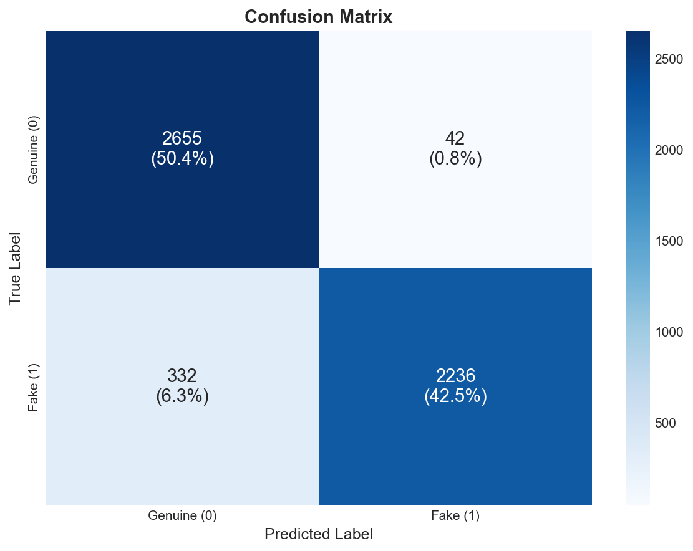
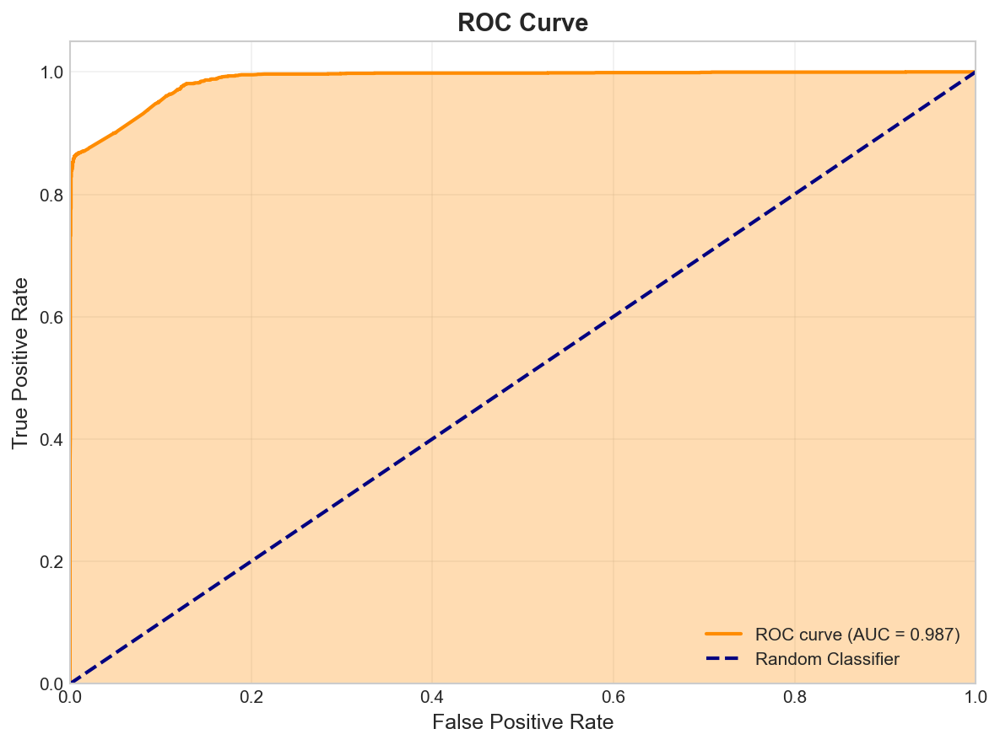
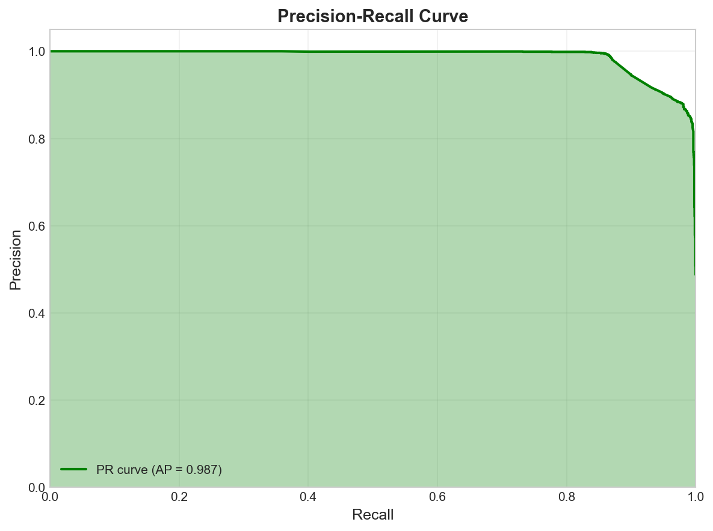
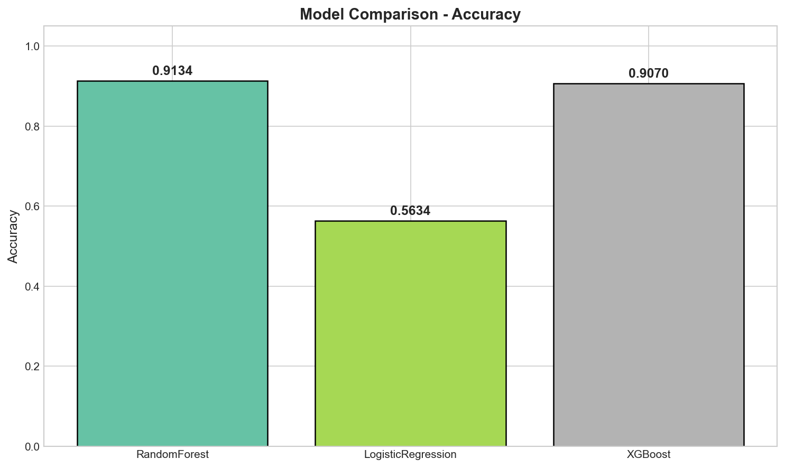

# 🤖 Fake Account Detection

[](https://www.python.org/downloads/)
[](https://scikit-learn.org/)
[](LICENSE)

Fake account classifier using a Random Forest pipeline with custom feature engineering for text, user info, and activity-based features.

## 📋 Table of Contents

- [Overview](#-overview)
- [Project Structure](#-project-structure)
- [Installation](#-installation)
- [Usage](#-usage)
- [Features](#-features)
- [Model Performance](#-model-performance)
- [Contributing](#-contributing)
- [License](#-license)

## 🎯 Overview

This project detects fake/bot accounts on social media platforms using machine learning. It analyzes user profiles based on:
- **Activity patterns** (tweets per day, account age)
- **Network metrics** (followers, friends, listed count)
- **Profile characteristics** (description length, default profile, verified status)
- **Demographic inference** (gender from name)

## 📁 Project Structure

```
fake-account/
├── 📂 app/                    # Streamlit/Flask application
│   └── app.py
├── 📂 config/                 # Configuration files
│   └── config.yaml
├── 📂 data/                   # Data files (gitignored)
│   ├── labeled_dataset.csv
│   └── .gitkeep
├── 📂 docs/                   # Documentation
│   └── figures/
├── 📂 models/                 # Trained models (gitignored)
│   ├── randomforest_pipeline.joblib
│   └── .gitkeep
├── 📂 notebooks/              # Jupyter notebooks
│   └── FakeAccount.ipynb
├── 📂 scripts/                # Utility scripts
│   ├── run_inference.py
│   └── compare_models.py
├── 📂 src/                    # Source code
│   ├── __init__.py
│   ├── feature_engineer.py
│   ├── train.py
│   └── visualize.py
├── 📂 tests/                  # Unit tests
│   ├── __init__.py
│   ├── conftest.py
│   ├── test_feature_engineer.py
│   └── test_model.py
├── .gitignore
├── LICENSE
├── pyproject.toml
├── README.md
└── requirements.txt
```

## 🚀 Installation

### Prerequisites

- Python 3.8 or higher
- pip or conda

### Setup

1. **Clone the repository**
   ```bash
   git clone https://github.com/ramezaboud/Fake-account.git
   cd Fake-account
   ```

2. **Create virtual environment**
   ```bash
   python -m venv venv
   source venv/bin/activate  # Linux/Mac
   # or
   .\venv\Scripts\activate   # Windows
   ```

3. **Install dependencies**
   ```bash
   pip install -r requirements.txt
   ```

4. **Install package in development mode**
   ```bash
   pip install -e .
   ```

## 💻 Usage

### Training the Model

```bash
cd src
python train.py
```

This will:
- Load data from `data/labeled_dataset.csv`
- Train a RandomForest model with GridSearchCV
- Save the pipeline to `models/randomforest_pipeline.joblib`

### Running Inference

```python
import joblib
import pandas as pd

# Load the trained pipeline
pipeline = joblib.load('models/randomforest_pipeline.joblib')

# Prepare your data
user_data = pd.DataFrame([{
    'statuses_count': 100,
    'followers_count': 50,
    'friends_count': 20,
    'favourites_count': 5,
    'listed_count': 1,
    'name': 'John Doe',
    'lang': 'en',
    'created_at': '2020-01-01 12:00:00',
    'description': 'Hello world!',
    'default_profile': 0,
    'verified': 0
}])

# Make prediction
prediction = pipeline.predict(user_data)
probability = pipeline.predict_proba(user_data)[:, 1]

print(f"Prediction: {'Fake' if prediction[0] == 1 else 'Real'}")
print(f"Fake Probability: {probability[0]:.2%}")
```

### Running Tests

```bash
pytest tests/ -v
```

## 🔧 Features

The model uses 12 engineered features:

| Feature | Description |
|---------|-------------|
| `statuses_count` | Total number of tweets |
| `followers_count` | Number of followers |
| `friends_count` | Number of following |
| `favourites_count` | Number of likes |
| `listed_count` | Number of lists user is on |
| `sex_code` | Gender inferred from name (-2 to 2) |
| `lang_code` | Language code (encoded) |
| `tweets_per_day` | Average tweets per day |
| `account_age_days` | Account age in days |
| `description_length` | Length of profile description |
| `default_profile` | Whether profile is default (0/1) |
| `verified` | Whether account is verified (0/1) |

## 📊 Model Performance

### Model Comparison

We evaluated three different models:

| Model | Accuracy | ROC AUC | F1 Score |
|-------|----------|---------|----------|
| **RandomForest** 🏆 | **91.34%** | 93.42% | **92.47%** |
| XGBoost | 90.70% | **94.65%** | 90.55% |
| Logistic Regression | 56.34% | 61.40% | 65.67% |

> **Best Model**: RandomForest with `max_depth=10`, `min_samples_split=5`, `n_estimators=300`

### Evaluation Visualizations

<div align="center">

| Confusion Matrix | ROC Curve |
|:---:|:---:|
|  |  |

| Precision-Recall Curve | Model Comparison |
|:---:|:---:|
|  |  |

</div>

### Classification Report (RandomForest)

```
              precision    recall  f1-score   support

    Real (0)       0.92      0.99      0.95      3704
    Fake (1)       0.84      0.46      0.59       359

    accuracy                           0.91      4063
   macro avg       0.88      0.72      0.77      4063
weighted avg       0.91      0.91      0.90      4063
```

## 🧪 Running Experiments

Use the Jupyter notebook for interactive exploration:

```bash
jupyter notebook notebooks/FakeAccount.ipynb
```

## 🤝 Contributing

1. Fork the repository
2. Create your feature branch (`git checkout -b feature/AmazingFeature`)
3. Commit your changes (`git commit -m 'Add some AmazingFeature'`)
4. Push to the branch (`git push origin feature/AmazingFeature`)
5. Open a Pull Request

## 📄 License

This project is licensed under the MIT License - see the [LICENSE](LICENSE) file for details.

## 👤 Author

**Ramez Aboud**
- GitHub: [@ramezaboud](https://github.com/ramezaboud)

---

⭐ Star this repo if you find it useful!
